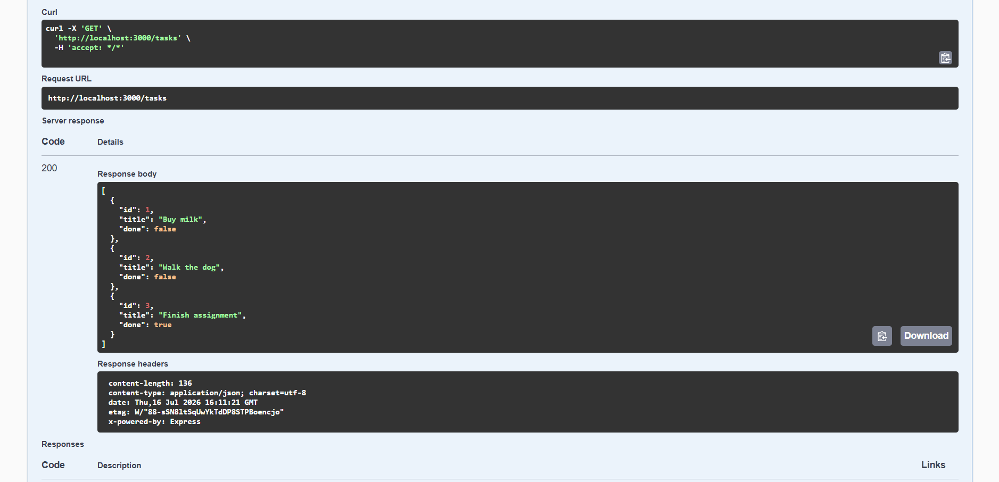
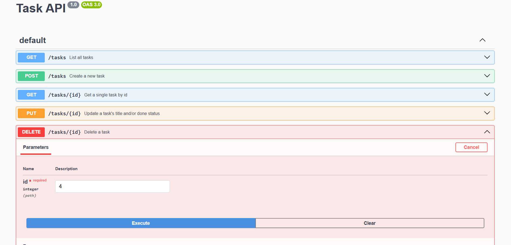

# Task API

A simple CRUD (Create, Read, Update, Delete) REST API for managing a to-do list, built with Node.js and Express. Task data is stored in memory — it resets whenever the server restarts.

## How to Run

1. Clone this repository:
   ```
   git clone https://github.com/linamarg/flyrank-01.git
   cd flyrank-01
   ```

2. Install dependencies:
   ```
   npm install
   ```

3. Start the server:
   ```
   node server.js
   ```

4. The API will be running at `http://localhost:3000`.

5. Interactive API docs (Swagger UI) are available at `http://localhost:3000/docs`.

## Endpoints

| Method | Endpoint       | Description                          | Success Status | Error Status |
|--------|----------------|---------------------------------------|-----------------|--------------|
| GET    | `/`            | API info                              | 200             | —            |
| GET    | `/health`      | Health check                          | 200             | —            |
| GET    | `/tasks`       | List all tasks                        | 200             | —            |
| GET    | `/tasks/:id`   | Get a single task by id               | 200             | 404          |
| POST   | `/tasks`       | Create a new task                     | 201             | 400          |
| PUT    | `/tasks/:id`   | Update a task's title and/or done status | 200          | 400, 404     |
| DELETE | `/tasks/:id`   | Delete a task                         | 204             | 404          |

## Example Request

```
curl -i -X POST http://localhost:3000/tasks -H "Content-Type: application/json" -d '{"title":"Test task"}'
```

```
HTTP/1.1 201 Created
Content-Type: application/json; charset=utf-8

{"id":4,"title":"Test task","done":false}
```

## Swagger UI

All endpoints can be tested interactively at `/docs`, including the full CRUD cycle (create, list, update, delete) via "Try it out."




## Notes

- Data is stored in memory only — restarting the server resets the task list back to the seeded example tasks.
- Input validation: `POST` and `PUT` requests reject a missing or empty `title` with a `400` error.
- Unknown task ids return a `404` error with a JSON message.
