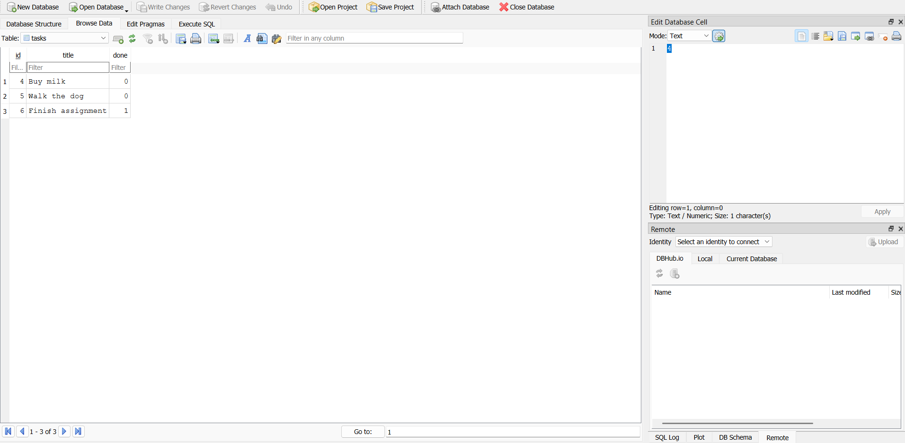

# Task API

A simple CRUD (Create, Read, Update, Delete) REST API for managing a to-do list, built with Node.js and Express. Task data is stored in a SQLite database — it persists across server restarts.

## How to Run

1. Clone this repository:
   ```
   git clone https://github.com/linamarg/flyrank-01.git
   cd flyrank-01
   ```

2. Install dependencies:
   ```
   npm install
   ```

3. Start the server:
   ```
   node server.js
   ```

4. The API will be running at `http://localhost:3000`.

5. Interactive API docs (Swagger UI) are available at `http://localhost:3000/docs`.

## Database

### Why SQLite was chosen

SQLite was used because it requires no separate database server or installation — it's a single file (`tasks.db`) that gets created automatically the first time the app runs. This made it a good fit for this stage of the project, where the goal was to prove that swapping storage layers (in-memory → real database) doesn't require changing the API itself. The routes in `server.js` are unchanged from the in-memory version — only the internals of `taskRepository.js` changed.

### Where the database file is stored

The database is stored as `tasks.db` in the project's root directory. It's gitignored, since it's generated data rather than source code. It's created automatically if it doesn't already exist, along with the `tasks` table. Three example tasks are seeded on first run only — the app checks the row count on startup and skips seeding if the table isn't empty.

### Verifying persistence

Data was confirmed to survive an app restart: created tasks remained after stopping and restarting `node server.js`. Data was also confirmed to survive being modified outside the app entirely — using DB Browser for SQLite to run manual queries directly against `tasks.db` and seeing those changes reflected immediately through the running API, without a restart.

### Database viewer

Opened in DB Browser for SQLite (Browse Data tab), showing the `tasks` table:



### Example SQL query executed

```sql
DELETE FROM tasks WHERE done = 1;
```

Running this after marking all tasks as done deleted every row. Restarting the server correctly triggered the seed logic again — but the new tasks were assigned ids `4, 5, 6` rather than restarting at `1`, since SQLite's `AUTOINCREMENT` never reuses an id, even after every row in the table has been deleted.

## Endpoints

| Method | Endpoint       | Description                          | Success Status | Error Status |
|--------|----------------|---------------------------------------|-----------------|--------------|
| GET    | `/`            | API info                              | 200             | —            |
| GET    | `/health`      | Health check                          | 200             | —            |
| GET    | `/tasks`       | List all tasks                        | 200             | —            |
| GET    | `/tasks/:id`   | Get a single task by id               | 200             | 404          |
| POST   | `/tasks`       | Create a new task                     | 201             | 400          |
| PUT    | `/tasks/:id`   | Update a task's title and/or done status | 200          | 400, 404     |
| DELETE | `/tasks/:id`   | Delete a task                         | 204             | 404          |

## Example Request

```
curl -i -X POST http://localhost:3000/tasks -H "Content-Type: application/json" -d '{"title":"Test task"}'
```

```
HTTP/1.1 201 Created
Content-Type: application/json; charset=utf-8

{"id":4,"title":"Test task","done":false}
```

## Swagger UI

All endpoints can be tested interactively at `/docs`, including the full CRUD cycle (create, list, update, delete) via "Try it out."


## Notes

- Data is stored in SQLite (`tasks.db`) — restarting the server does not reset the task list. The seeded example tasks only appear on the very first run, when the database is empty.
- Input validation: `POST` and `PUT` requests reject a missing or empty `title` with a `400` error.
- Unknown task ids return a `404` error with a JSON message.
